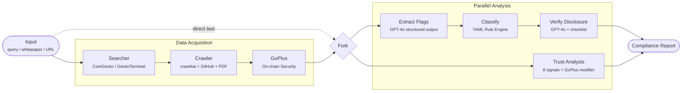

# MiCAR Compliance Agent

> A hybrid neuro-symbolic multi-agent system for regulatory compliance analysis and early scam detection in crypto-assets. Designed for multi-jurisdiction extensibility — ships with EU MiCAR and US SEC rule sets.

[]()
[]()
[]()

**Reference implementation** of the Compliance Agent described in:

> Trerotola, M., Parente, M., & Calvaresi, D. (2026). *A Hybrid Multi-Agent System for Early Scam Detection in Crypto-Assets.* Applied Sciences, MDPI.

> **About this work.** Developed during a PhD at Politecnico di Torino. The system reflects practical experience with regulatory NLP, supervisory technology, and the operational realities of crypto-asset oversight under MiCAR.

---

## Why This Matters

MiCAR enforcement entered its active phase in 2024-2025, leaving European supervisory authorities with a high-volume documentary triage problem: thousands of new token offerings must be screened against disclosure obligations and taxonomy rules with limited analyst capacity. Existing blockchain intelligence platforms (Chainalysis, Elliptic) focus on **retrospective on-chain forensics** and do not perform automated MiCAR-aligned documentary assessment.

This system addresses that gap with a **prospective, off-chain triage layer** that combines LLM semantic extraction with deterministic rule-based compliance logic, producing auditable and explainable outputs aligned with EU AI Act transparency requirements.

## Overview

Given a crypto-asset project (by name, whitepaper URL, or raw text), the system runs a multi-stage analysis pipeline:

1. **Project Discovery** — resolves metadata via CoinGecko; discovers newly launched tokens via GeckoTerminal
2. **Content Extraction** — crawls websites (including SPAs), GitHub repos, and PDF whitepapers using crawl4ai
3. **On-Chain Security** — detects honeypots, hidden taxes, and owner privileges via GoPlus Security API
4. **Regulatory Classification** — deterministic YAML rule engine maps 19 asset flags to jurisdictional taxonomy
5. **Disclosure Verification** — LLM verifies compliance with class-specific regulatory requirements
6. **Trust & Risk Assessment** — 8 weighted trust signals + on-chain modifier, scored and classified by risk level

The compliance and trust branches run **in parallel** via LangGraph, producing a unified report.

## Architecture

> **Regulatory transparency.** This system is designed and documented for compliance with EU AI Act Articles 9-15 (risk management, data governance, logging, transparency, human oversight). See [docs/eu_ai_act_compliance.md](docs/eu_ai_act_compliance.md) for the full mapping.



See [docs/architecture.md](docs/architecture.md) for full data flow, state schema, and component details.

## Quick Start

```bash
# Clone and install
git clone https://github.com/mariotrerotola/mas.git && cd mas
uv sync --all-extras
playwright install chromium    # required for SPA crawling

# Set your API key
export MAS_OPENAI_API_KEY=sk-...

# Analyze a known project
python -m mas search "uniswap"

# Scan newly launched tokens
python -m mas scan-new --limit 10

# Analyze a local whitepaper
python -m mas analyze whitepaper.pdf

# Demo mode (no API key needed)
python -m mas analyze whitepaper.md --mock

# Web UI
streamlit run app/streamlit_app.py
```

## Pipeline Stages

| Stage | Method | Output |
|-------|--------|--------|
| Discovery | CoinGecko + GeckoTerminal | `ProjectMetadata` |
| Crawling | crawl4ai (SPA + static) / pymupdf (PDF) / GitHub raw | Whitepaper text |
| On-Chain Security | GoPlus API (free, no key) | `ContractSecurity` |
| Asset Flag Extraction | GPT-4o structured output | 19 `AssetFlag` values |
| Classification | YAML rule engine (deterministic) | `ClassificationResult` |
| Disclosure Verification | GPT-4o + jurisdiction-specific checklist | `ComplianceFlags` |
| Trust Analysis | GPT-4o (8 signals) + GoPlus modifier | `TrustAnalysisResult` |

## Multi-Jurisdiction Support

The rule engine is **jurisdiction-agnostic** — adding a new regulatory framework requires only two YAML files and zero code changes.

```
src/mas/rules/
  micar_v1/           # EU MiCAR (Regulation 2023/1114)
  sec_v1/             # US SEC (Howey Test + Securities Act 1933)
```

**EU MiCAR** classifies into: `SECURITY`, `EMT`, `ART`, `OTHER`, `NON_MICAR`, `NON_CLASSIFIABLE`
**US SEC** classifies into: `investment_contract` (Howey), `security`, `commodity`, `non_security_nft`

The same asset flags produce jurisdiction-appropriate results:

```python
flags = {"utility_function": True, "governance_function": True}

eu_engine.classify(flags)   # → "other"     (MiCAR utility token)
sec_engine.classify(flags)  # → "commodity" (CFTC jurisdiction, CEA § 1a(9))
```

See [docs/extending_to_new_jurisdictions.md](docs/extending_to_new_jurisdictions.md) for the full extension guide.

## Example Output

```
Project: Uniswap (UNI)
Classification: OTHER (Rule OTHER_1)
Compliance Score: 25% (4/16)
Trust Score: 87% (LOW RISK)

Trust Signals:
  team_transparency       4/5    tokenomics_clarity    5/5
  audit_status            3/5    roadmap_realism       4/5
  red_flags_detected      5/5    technical_depth       4/5
  funding_transparency    5/5    community_governance  5/5

On-Chain (GoPlus): +5 modifier | verified | 13M holders | no red flags
```

## Early Warning Scanner

Scans newly launched tokens from GeckoTerminal DEX pools, runs GoPlus on-chain checks, and produces a risk-sorted summary:

```bash
$ python -m mas scan-new --limit 10

=== Scan Summary (10 tokens) ===

  HIGH RISK    ZynCoin           Trust: 23%  GoPlus:-5 [closed_src]
  HIGH RISK    GANMAO            Trust: 23%  GoPlus:-5 [closed_src]
  ELEVATED     geckohouse        Trust: 33%  GoPlus:+5
  ELEVATED     Zygo The Frog     Trust: 34%  GoPlus:+5
```

## Project Structure

```
src/mas/
  agents/
    searcher.py            CoinGecko project discovery
    geckoterminal.py       New token discovery (DEX pools)
    crawler.py             crawl4ai + PDF + GitHub README
    goplus.py              On-chain contract security
    ratelimit.py           API rate limiter (token bucket)
  graph/
    builder.py             LangGraph pipeline (parallel branches)
    nodes.py               Node factories
  rules/
    engine.py              Jurisdiction-agnostic YAML rule engine
    micar_v1/              EU MiCAR rules + disclosure checklists
    sec_v1/                US SEC rules (Howey Test)
  schemas/                 Pydantic v2 data models
  prompts/v1/              LLM system prompts
  config.py                Settings (env vars, MAS_ prefix)
  factory.py               Pipeline factory
  cli.py                   CLI: analyze, search, batch, scan-new
  report.py                Markdown / JSON export

app/streamlit_app.py       Streamlit web UI
tests/                     160 tests (pytest)
fixtures/                  Mock GPT-4o responses
docs/                      Architecture + extension guide
```

## Configuration

| Variable | Default | Description |
|----------|---------|-------------|
| `MAS_OPENAI_API_KEY` | required | OpenAI API key |
| `MAS_OPENAI_MODEL` | `gpt-4o` | LLM model identifier |
| `MAS_MOCK_MODE` | `false` | Use pre-computed fixture responses |
| `MAS_COINGECKO_API_KEY` | optional | CoinGecko API key (higher rate limits) |
| `MAS_CRAWLER_TIMEOUT` | `30` | HTTP request timeout (seconds) |
| `MAS_CRAWLER_MAX_URLS` | `5` | Maximum URLs crawled per project |

## Testing

```bash
PYTHONPATH=src python -m pytest tests/ -v   # 160 tests
python -m pytest tests/ -m "not live"       # skip API-dependent tests
ruff check src/ tests/                      # linting
```

## Regulatory References

| Jurisdiction | Regulation | Key Articles |
|-------------|-----------|-------------|
| EU | MiCAR — Regulation (EU) 2023/1114 | Art. 6, 19, 51 + Annexes I-III |
| EU | MiFID II — securities fallback | Directive 2014/65/EU |
| US | Securities Act of 1933, § 2(a)(1) | Definition of "security" |
| US | Howey Test — SEC v. W.J. Howey Co. (1946) | Investment contract analysis |
| US | SEC FinHub Framework (April 2019) | Digital asset classification |
| US | CFTC — Commodity Exchange Act § 1a(9) | Commodity classification |

## License

MIT
