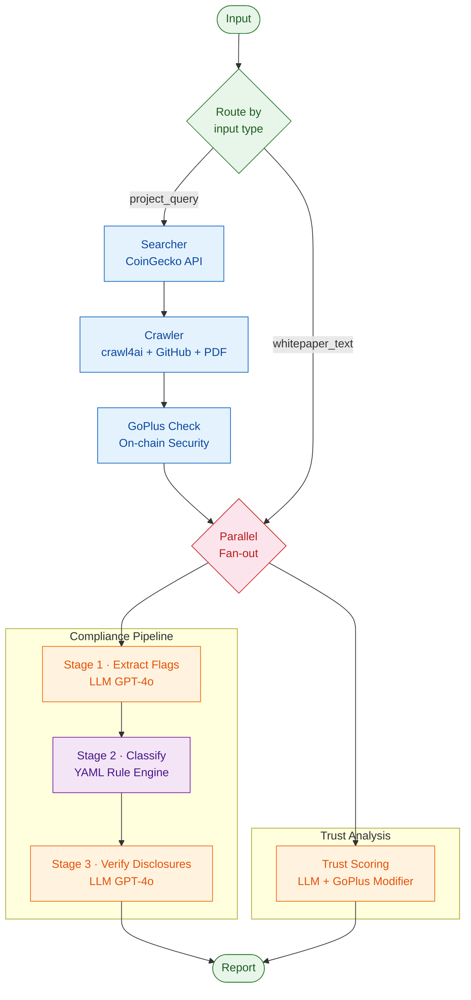

# Architecture

## System Overview

The MiCAR Compliance Agent is a hybrid neuro-symbolic multi-agent system
that combines LLM-based semantic extraction (OpenAI GPT-4o) with a
deterministic YAML-driven rule engine for regulatory compliance analysis
of crypto-asset projects.

The system is designed for **multi-jurisdiction extensibility** — it ships
with EU MiCAR and US SEC rule sets, and new jurisdictions can be added
by creating two YAML files with zero code changes.

Reference: Trerotola, Parente, Calvaresi (2026). *A Hybrid Multi-Agent
System for Early Scam Detection in Crypto-Assets.* Applied Sciences, MDPI.

## Pipeline Architecture



Both branches run in parallel via LangGraph conditional fan-out.
State is auto-merged because each branch writes to different keys.

## Agents

### Searcher Agent
- **Source:** CoinGecko API (free tier) for project metadata
- **New token discovery:** GeckoTerminal `/networks/new_pools` endpoint
- **Output:** `ProjectMetadata` (name, symbol, URLs, contract addresses, GitHub repos)
- **Rate limiting:** 1.5s minimum interval between calls (free tier: ~30 req/min)
- **Files:** `src/mas/agents/searcher.py`, `src/mas/agents/geckoterminal.py`

### Crawler Agent
- **Engine:** crawl4ai (default) — handles both static HTML and JavaScript-rendered SPA sites
- **Event loop:** Uses `nest_asyncio` to safely run async crawl4ai from sync context (avoids event loop conflicts in batch mode)
- **Fallback chain:** crawl4ai → trafilatura (if crawl4ai not installed)
- **Special handlers:**
  - GitHub README — direct fetch from `raw.githubusercontent.com` (tries `main` then `master` branch)
  - PDF — download + extract with pymupdf
- **File:** `src/mas/agents/crawler.py`

### GoPlus Security Agent
- **Source:** GoPlus Security API (free, no key required)
- **Checks:** honeypot, hidden owner, mintable, sell/buy tax, proxy, blacklist, self-destruct, trust list
- **Output:** `ContractSecurity` with `trust_modifier()` ranging from -30 to +10
- **Multi-chain:** EVM chains (Ethereum, BSC, Polygon, Arbitrum, Base, etc.) + Solana
- **Rate limiting:** 0.5s minimum interval
- **File:** `src/mas/agents/goplus.py`

### Rate Limiter
- **Pattern:** Token-bucket style with minimum interval enforcement
- **Applied to:** CoinGecko (1.5s), GoPlus (0.5s), GeckoTerminal (0.5s)
- **File:** `src/mas/agents/ratelimit.py`

## Analysis Pipeline (3 Stages)

### Stage 1: Asset Flag Extraction (LLM)
- **Input:** whitepaper/website text
- **Model:** GPT-4o with `with_structured_output(AssetFlags)`
- **Output:** 19 `AssetFlag` values — each carries `value: bool`, `evidence: str`, `confidence: float`
- **Prompt:** `src/mas/prompts/v1/asset_flags.md` (from paper Listing A3)

### Stage 2: Classification (Rule Engine)
- **Input:** 19 boolean flags from Stage 1
- **Engine:** YAML rules with `all/any/none` condition operators, first-match-wins semantics
- **Jurisdiction-agnostic:** Same engine class loads any rule set directory
- **Output:** `ClassificationResult` with `micar_class`, `jurisdiction`, `jurisdiction_class`, `triggered_rules`
- **Rules:** `src/mas/rules/micar_v1/` (EU) or `src/mas/rules/sec_v1/` (US)

### Stage 3: Disclosure Verification (LLM)
- **Input:** whitepaper text + class-specific disclosure checklist (injected into prompt)
- **Output:** `ComplianceFlags` with per-requirement `fulfilled`, `evidence`, `confidence`
- **Checklists:** loaded from `disclosures.yaml` in the active jurisdiction directory

## Trust Analysis (Parallel Branch)

Runs concurrently with the compliance pipeline on the same whitepaper text.

### LLM Signal Extraction
8 trust signals, each scored 1-5:

| Signal | Weight | Description |
|--------|--------|-------------|
| `red_flags_detected` | 2.0 | Inverted: 5 = no red flags |
| `team_transparency` | 1.5 | Named team with verifiable identities |
| `tokenomics_clarity` | 1.5 | Supply, distribution, vesting documented |
| `audit_status` | 1.5 | Named audit firms, bug bounties |
| `roadmap_realism` | 1.0 | Concrete vs vague milestones |
| `technical_depth` | 1.0 | Protocol design, cryptographic proofs |
| `funding_transparency` | 1.0 | Use of raised funds described |
| `community_governance` | 0.5 | DAO voting, proposal process |

### Scoring

**Base score:** `sum(weight_i * score_i) / sum(weight_i * 5) * 100`

**On-chain modifier** (GoPlus): applied as bonus/malus to base score.
- Honeypot detected: -30
- Hidden owner: -10
- Owner can modify balances: -10
- Closed source (unverified): -5
- Verified + not proxy: +5
- On trust list: +5
- 1000+ holders: +3

**Final score:** `clamp(base_score + modifier, 0, 100)`

### Risk Classification
| Score | Level |
|-------|-------|
| >= 75% | LOW_RISK |
| >= 55% | MODERATE |
| >= 35% | ELEVATED |
| < 35% | HIGH_RISK |

## Multi-Jurisdiction Rule Engine

The rule engine is completely decoupled from any specific regulation:

```
src/mas/rules/
  micar_v1/             EU MiCAR (8 rules, 4 disclosure checklists)
  sec_v1/               US SEC (7 rules, 4 disclosure checklists)
```

Adding a new jurisdiction requires **zero code changes** — only two YAML files
(`classification.yaml` + `disclosures.yaml`). The engine maps non-MiCAR class
labels to the closest `MiCARClass` enum value for compatibility, and preserves
the original label in `ClassificationResult.jurisdiction_class`.

### EU MiCAR Taxonomy

| Class | Description | Disclosures | Key Articles |
|-------|-------------|-------------|-------------|
| SECURITY | Securities (MiFID II) | 4 | Art. 2(4) |
| EMT | E-Money Token | 21 | Art. 51 + Annex III |
| ART | Asset-Referenced Token | 22 | Art. 19 + Annex II |
| OTHER | Utility/governance | 16 | Art. 6 + Annex I |
| NON_MICAR | NFTs, out of scope | 1 | Art. 2(3) |
| NON_CLASSIFIABLE | Insufficient data | 1 | — |

### US SEC Taxonomy

| Class | Legal Basis | Disclosures |
|-------|------------|-------------|
| `investment_contract` | Howey Test (1946) + FinHub (2019) | 9 |
| `security` | Securities Act § 2(a)(1) | 5 |
| `commodity` | CFTC CEA § 1a(9) | 3 |
| `non_security_nft` | SEC informal guidance | 2 |

See [docs/extending_to_new_jurisdictions.md](extending_to_new_jurisdictions.md) for the step-by-step extension guide.

## Data Flow

```
ProjectMetadata
  |-- website_urls        --> Crawler (crawl4ai)
  |-- whitepaper_url      --> Crawler (pymupdf for PDF)
  |-- github_urls         --> Crawler (raw README)
  |-- contract_addresses  --> GoPlus (on-chain security)
  +-- description         --> Fallback text

ComplianceState (TypedDict, total=False)
  |-- project_query / whitepaper_text  (input)
  |-- project_metadata                 (Searcher output)
  |-- crawled_urls                     (Crawler output)
  |-- contract_security                (GoPlus output)
  |-- asset_flags                      (Stage 1 LLM)
  |-- classification                   (Stage 2 Rules)
  |-- compliance_flags                 (Stage 3 LLM)
  +-- trust_analysis                   (Trust LLM + GoPlus)
```

## Early Warning Scanner

The `scan-new` command discovers freshly launched tokens and runs the
full analysis pipeline on each:

```
GeckoTerminal (/networks/new_pools)
  --> Extract token metadata (name, chain, contract address)
    --> GoPlus on-chain check (honeypot, tax, owner)
      --> Crawler (website if available)
        --> Pipeline (compliance + trust in parallel)
          --> Risk-sorted summary report
```

Rate limiting is enforced at every API boundary to stay within free-tier
limits during batch operations.

## Tech Stack

| Component | Technology |
|-----------|-----------|
| Language | Python 3.12 |
| Package Manager | uv |
| Pipeline Framework | LangGraph (StateGraph, parallel fan-out) |
| LLM Integration | LangChain + OpenAI GPT-4o (structured output) |
| Schema Validation | Pydantic v2 (computed fields, `total=False` TypedDict) |
| Rule Engine | YAML-driven, jurisdiction-swappable, `all/any/none` logic |
| Web Crawling | crawl4ai (SPA + static) + nest_asyncio |
| PDF Extraction | pymupdf |
| On-chain Security | GoPlus Security API |
| Token Discovery | CoinGecko + GeckoTerminal |
| Rate Limiting | Custom `RateLimiter` (min interval enforcement) |
| UI | Streamlit |
| Linting | ruff |
| Type Checking | mypy (strict mode) |
| Testing | pytest (160 tests) |

## Test Coverage

| Module | Tests | Key Scenarios |
|--------|-------|---------------|
| Rule Engine | 34 | MiCAR classification, SEC Howey Test, cross-jurisdiction, priority |
| Schemas | 11 | Validation bounds, computed fields, JSON round-trip |
| Trust Analysis | 22 | Scoring, risk thresholds, parallel pipeline, GoPlus modifier |
| Crawler | 11 | Multi-URL, routing, GitHub README, multi-run |
| GoPlus | 14 | Modifier bounds, red flags, API edge cases, response parsing |
| Scan/Search | 5 | New coin listing, limit, error handling |
| Pipeline | 3 | End-to-end graph, state keys |
| Prompts | 10 | Loading, hashing, version tags |
| Audit | 7 | File I/O, JSONL round-trip |
| SEC Rules | 16 | Howey prongs, equity/debt, commodity, NFT, disclosures |
| **Total** | **160** | |
